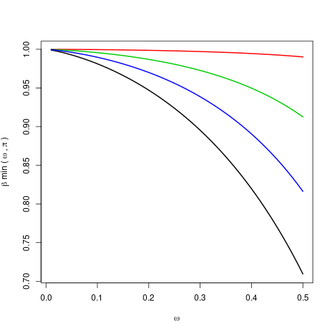
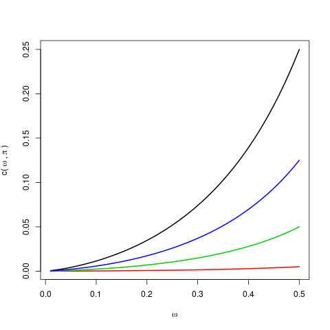

[](http://quantlet.de/)

## [](http://quantlet.de/) **GRF_clt_parameter** [](http://quantlet.de/)

```yaml


Name of Quantlet: GRF_clt_parameter

Published in: 'METIS'

Description: 'Visualisation of c and beta_min dependent on least fraction omega and minimum bound for probability that specific feature is used as analysis for the behaviour of central limit theorem (CLT) of GRF.'

Keywords: 'visualisation, parameter, CLT, GRF, central limit theorem, RF'

Author: 'Marius Sterling'

See also: ''

Submitted:  '14.09.2020'

```





### R Code
```r

c_func = function(w, pi) {
  return(pi * log(1 - w) / log(w) / 2)
}
b_min = function(w, pi) {
  return(1 + log(1 - w) / (1 - log(w) / pi))
}


w = seq(0.01, 0.5, 0.01)
png(file='c_function.png', bg = "transparent")
  plot (w, c_func(w, 0.50), type = 'l', lwd = 2,
        ylab = expression('c('~omega~','~pi~')'),
        xlab = expression(omega))
  lines(w, c_func(w, 0.01), type = 'l', col = 2, lwd = 2)
  lines(w, c_func(w, 0.10), type = 'l', col = 3, lwd = 2)
  lines(w, c_func(w, 0.25), type = 'l', col = 4, lwd = 2)
dev.off()

png(file='beta_min_function.png', bg = "transparent")
  plot (w, b_min(w, 0.50), type = 'l', lwd = 2,
        ylab = expression(beta~min~'('~omega~','~pi~')'),
        xlab = expression(omega))
  lines(w, b_min(w, 0.01), type = 'l', col = 2, lwd = 2)
  lines(w, b_min(w, 0.10), type = 'l', col = 3, lwd = 2)
  lines(w, b_min(w, 0.25), type = 'l', col = 4, lwd = 2)
dev.off()

```

automatically created on 2020-09-15