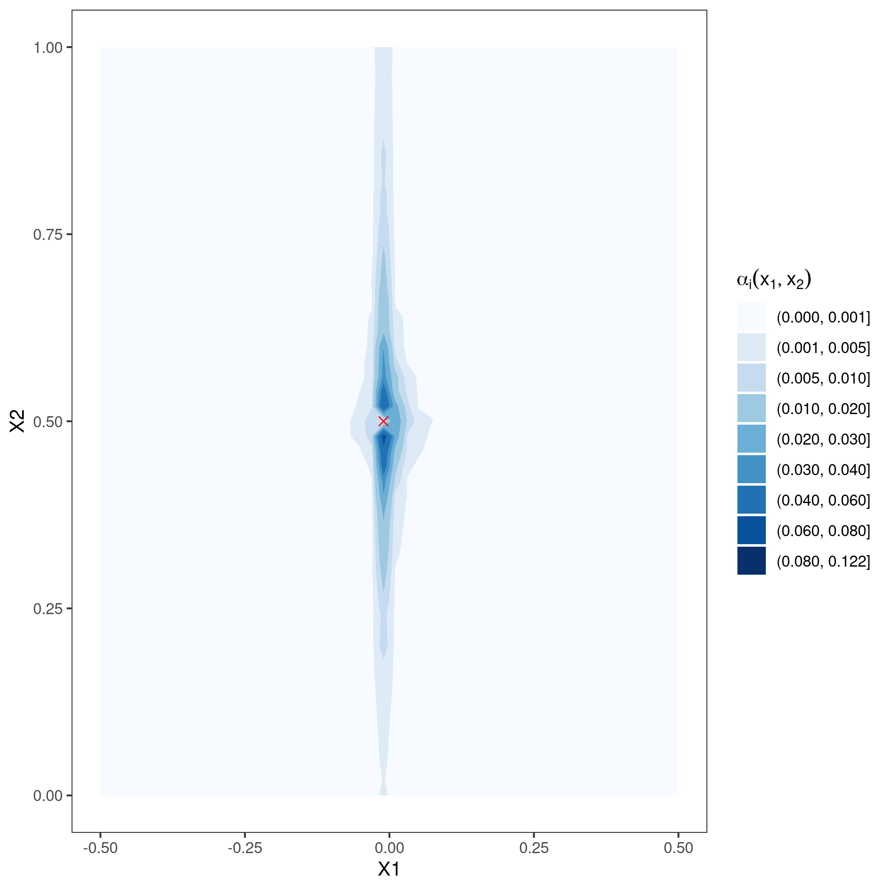
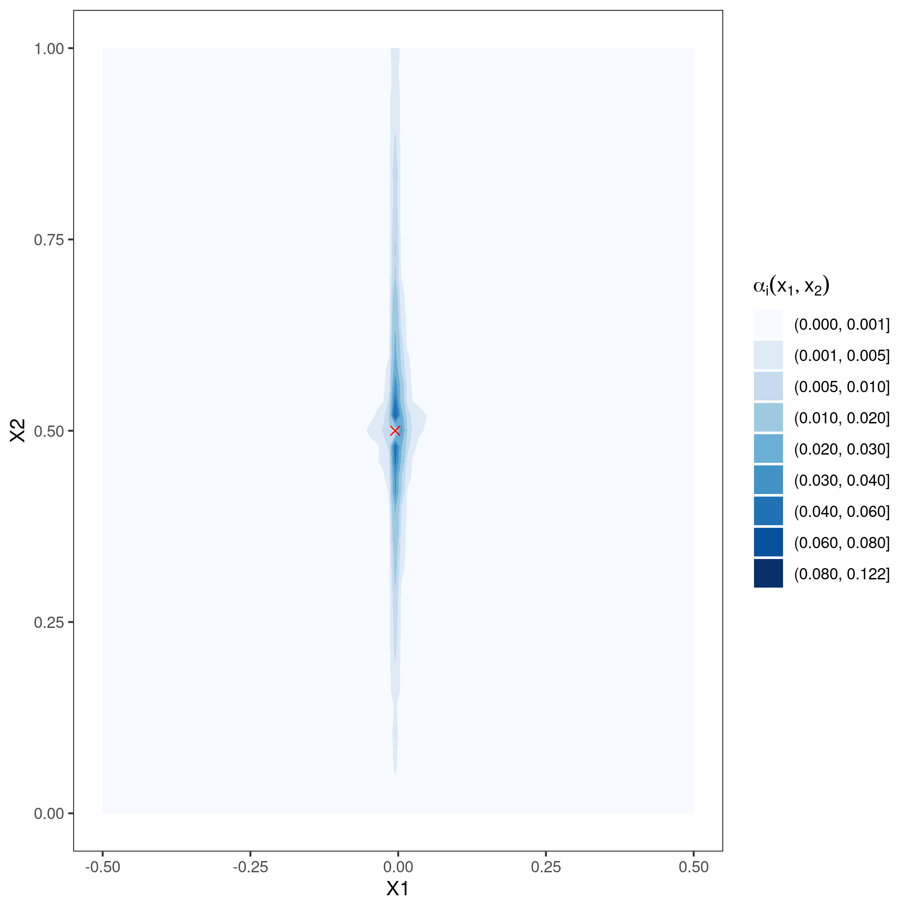
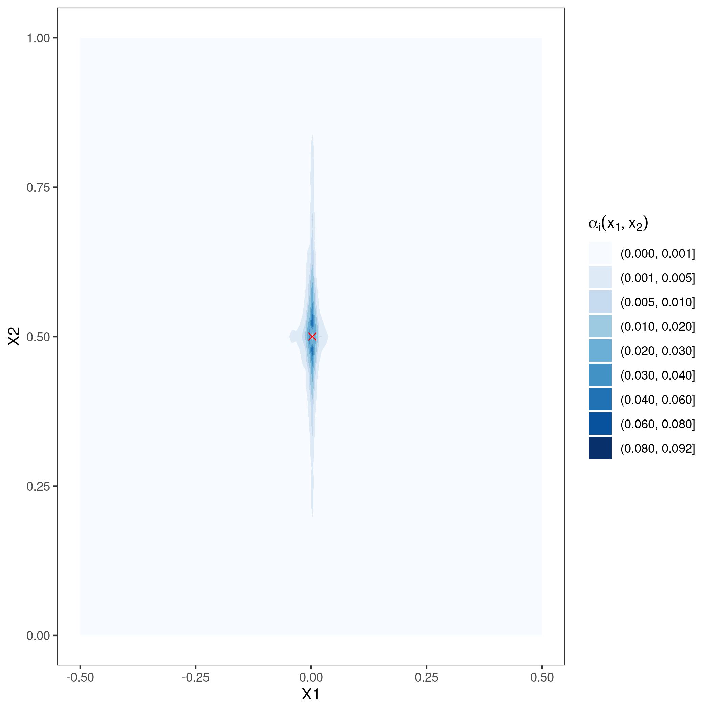

[](http://quantlet.de/)

## [](http://quantlet.de/) **GRF_effective_weights2D** [](http://quantlet.de/)

```yaml


Name of Quantlet: GRF_effective_weights2D

Published in: 'GRF'

Description: 'Estimation of effective weights alpha_i(x_1, x_2) for the infeasable observations theta_tilde. The effective weights are computed by a regression forest on a grid of observations x_ij=(-0.5 + i/n1, 0 + 0.02 * j) for i=1,...,n1 and j=0,...,50, for n1=50, 100, 200 and target variable Y_i=theta(x_ij) + eps_ij, for a given theta function, here triangle function theta(x_ij) = max(0, 1 - |x_ij,1|/0.2), with Gaussian noise eps_ij with mean zero and standard deviation of 0 and 0.1.'

Keywords: 'RF, GRF, infeasable function, estimation, effective weights, bandwidth, contour'

Author: 'Marius Sterling'

See also: ''

Submitted:  '20.01.2021'

```








### R Code
```r

rm(list=ls())
library(grf)
library(dplyr)
library(ggplot2)
library(glue)
library(NNTbiomarker)
set.seed(42)


# Function definition for data --------------------------------------------
get_x = function(n, seed=NULL){
  set.seed(seed)
  X = expand.grid(
    X1 = seq(-0.5, 0.5, length.out = n),
    X2 = seq(0, 1, 0.02)
  )
  # X = data.frame(matrix(
  #   c(
  #     seq(-0.5, 0.5, length.out = n),
  #     seq(-0.5, 0.5, length.out = 51)
  #     ),
  #   nrow = n,
  #   ncol = 2
  # ))
  # colnames(X) = c('X1', 'X2')
  return(X)
}
get_x_grid = function(n){
  X = expand.grid(
    X1 = seq(-0.5, 0.5, length.out = n),
    X2 = seq(-0.5, 0.5, length.out = n)
  )
  return(X)
}

theta_triangle = function(x, width){
  pmax(1 - abs((x[, 'X1']) / width), 0)
}

get_y = function(X, theta, sigma, seed=NULL){
  set.seed(NULL)
  n = nrow(X)
  return(theta(X) + rnorm(n, 0, sigma))
}


# Computing ---------------------------------------------------------------
for (sig in c(0, 0.1)){
  rfs = list()
  for (nX1 in c(50, 100, 200)){
    width = 0.2
    X = get_x(nX1, seed=42)
    theta = function(X) theta_triangle(X, width)
    Y = get_y(X, theta, sig, 42)
    rfs[[as.character(nX1)]] = rf = regression_forest(X, Y)
    eps_tilde = Y - theta(X)
    alpha = get_sample_weights(rf)
    theta_tilde = theta(X) + alpha %*% eps_tilde
    
    p = data.frame(cbind(X, Y)) %>% 
      ggplot(aes(X1, X2)) +
      geom_point(aes(colour = Y)) +
      scale_colour_gradient(low = "#132B43", high = "#56B1F7") +
      theme_bw() +
      theme(
        panel.grid.major = element_blank(),
        panel.grid.minor = element_blank(),
        panel.background = element_blank()
      )
    fn = glue(
      'scatter/',
      'RF_theta_triangle___theta_tilde___',
      'sigma{formatC(sig*100, width=3, flag="0")}___',
      'n{formatC(nX1, width=3, flag="0")}_scatter',
      '.png'
    )
    ggsave(fn, plot = p, dpi = 300)
  }
  
  alpha = lapply(rfs, function(x) get_sample_weights(x))
  alpha_max = max(sapply(alpha, max))
  rf_X.orig = lapply(rfs, function(x) x$X.orig)
  x1s_subset = expand.grid(c(0, 0.18, 0.2, 0.22, 0.4, 0.5), c(1, 0.5))
  for (n in as.integer(names(rfs))){
    for (i in 1:nrow(x1s_subset)){
      x1 = x1s_subset[i, 1]
      x2 = x1s_subset[i, 2]
      id = argmin(rowSums(cbind(rf_X.orig[[as.character(n)]][, 1] - x1, rf_X.orig[[as.character(n)]][, 2] - x2) ** 2))[1]
      fn = glue(
        'raster/',
        'RF_theta_triangle___effective_weights___',
        'sigma{formatC(sig*100, width=3, flag="0")}___',
        'n{formatC(as.integer(n), width=3, flag="0")}___',
        'x_{formatC(x1*100, width=3, flag="0")}_{formatC(x2*100, width=3, flag="0")}',
        '.png'
      )
      p = data.frame(cbind(rf_X.orig[[as.character(n)]], alpha = alpha[[as.character(n)]][, id])) %>%
        ggplot(aes(X1, X2, fill = alpha)) +
        geom_raster(interpolate = FALSE) +
        scale_fill_gradient2(
          limits = c(0, alpha_max),
          name = c(expression(alpha[i](x[1], x[2])))
        ) +
        theme_bw() +
        theme(
          panel.grid.major = element_blank(),
          panel.grid.minor = element_blank(),
          panel.background = element_blank()
        ) +
        annotate(
          "point",
          x = rf_X.orig[[as.character(n)]][id, 1],
          y = rf_X.orig[[as.character(n)]][id, 2],
          pch = 4,
          colour = 'red',
          size = 3
        )
      
      ggsave(fn, plot = p, dpi = 300)
      fn = glue(
        'contour/',
        'RF_theta_triangle___effective_weights___',
        'sigma{formatC(sig*100, width=3, flag="0")}___',
        'n{formatC(as.integer(n), width=3, flag="0")}___',
        'contour___',
        'x_{formatC(x1*100, width=3, flag="0")}_{formatC(x2*100, width=3, flag="0")}',
        '.png'
       )
      
      breaks = c(0, 0.001, 0.005, 0.01, 0.02, 0.03, 0.04, 0.06, 0.08, round(alpha_max, 3))
      contour = cbind(rf_X.orig[[as.character(n)]], alpha = alpha[[as.character(n)]][, id]) %>%
        ggplot(aes(X1, X2, z = alpha)) +
        geom_contour_filled(
          aes(fill = stat(level)),
          breaks = breaks
        ) +
        scale_fill_brewer(
          name = c(expression(alpha[i](x[1], x[2]))),
          palette = 'Blues',
          direction = 1,
          guide = 'legend',
          drop = FALSE
        ) +
        theme_bw() +
        theme(
          panel.grid.major = element_blank(),
          panel.grid.minor = element_blank(),
          panel.background = element_blank()
        ) +
        annotate(
          "point",
          x = rf_X.orig[[as.character(n)]][id, 1],
          y = rf_X.orig[[as.character(n)]][id, 2],
          pch = 4,
          colour = 'red',
          size = 2
        )
      ggsave(fn, plot = contour, dpi = 300)
    }
  }
}

# https://ostechnix.com/create-video-pdf-files-linux/
```

automatically created on 2021-01-21