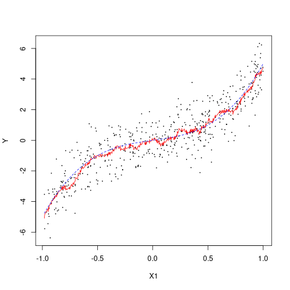
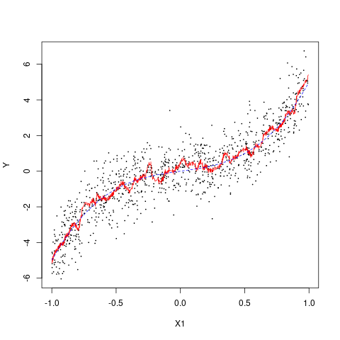
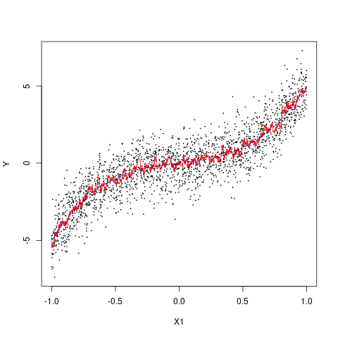

[](http://quantlet.de/)

## [](http://quantlet.de/) **GRF_effective_weights_quantileRF** [](http://quantlet.de/)

```yaml


Name of Quantlet: GRF_effective_weights_quantileRF

Published in: 'GRF'

Description: 'Estimation of effective weights alpha_i(x) for the infeasable observations theta_tilde. The effective weights are computed by a quantile random forest on n=500, 1000, 2000 observations of uniform distributed data x_i ~U[-1,1] and target variable Y_i=theta(x_i) + eps_i, for a given theta function, here polynomial theta(x) = x + 4x^3, with Gaussian noise eps_i with mean zero and standard deviation of 1.'

Keywords: 'RF, GRF, quantile RF, infeasable function, estimation, effective weights, bandwidth'

Author: 'Marius Sterling'

See also: ''

Submitted:  '22.01.2021'

```







### R Code
```r

rm(list=ls())
library(grf)
library(ggplot2)
library(glue)
set.seed(42)


get_x = function(n, c){
  X = matrix(sort(runif(n,-c, c)), nrow = n)
  colnames(X) = 'X1'
  return(X)
}
get_x_grid = function(n, c){
  X = matrix(seq(-c, c, length.out = n), nrow = n)
  colnames(X) = 'X1'
  return(X)
}
polynomial = function(x, p){
  X = matrix(1, nrow = nrow(x), ncol = ncol(x) * p + 1)
  cols = c('const')
  for (j in 1:ncol(x)){
    for (i in 1:p) {
      X[, (j - 1) * ncol(x) + i + 1] = x[, j] ** i
      cols = c(cols, glue("{colnames(x)[j]}^{i}"))
    }
  }
  colnames(X) = cols
  return(X)
}
theta_polynomial = function(x, p, beta){
  return(polynomial(x, p) %*% beta)
}

get_y = function(X, theta, sigma, seed=NULL){
  set.seed(NULL)
  n = nrow(X)
  return(theta(X) + rnorm(n, 0, sigma))
}
V_func = function(x, mu, sig, clip = NULL){
  res = -dnorm(x, mean = mu, sd = sig)
  if (!is.null(clip))
    res = sign(res) * pmax(abs(res), clip)
  return(res)
}
eps_tilde = function(X, Y, theta, sig, tau, clipV=NULL){
  res = matrix(0, nrow = nrow(X), ncol = length(tau))
  V = - V_func(theta(X), theta(X), sig, clip=clipV) ^ (-1)
  I = Y <= theta(X)
  for (i in 1:length(tau)){
    res[, i] = V * (tau[i] - I)
  }
  return(res)
}

tau = c(0.5)
sig = 1
width = 0.2
beta = c(0, 1, 0, 4)
p = 3
c = 1


rfs = list()
for (n in c(2000, 1000, 500)){
  X = get_x(n, c)
  theta = function(X) theta_polynomial(X, p, beta)
  Y = get_y(X, theta, sig, 42)
  rfs[[as.character(n)]] = rf = grf::quantile_forest(X, Y, quantiles = tau)
  alpha = get_sample_weights(rf)
  theta_tilde = theta(X) + alpha %*% eps_tilde(X, Y, theta, sig, tau)
  
  fn = glue(
    'qRF_polynom___beta{paste(beta, collapse="_")}___',
    'theta_tilde___',
    'q{formatC(tau*100, width=3, flag="0")}___',
    'sigma{formatC(sig*100, width=3, flag="0")}___',
    'n{formatC(as.integer(n), width=4, flag="0")}',
    '.png'
  )

  png(file = fn)
    plot(X[, 'X1'], Y, type = 'p', pch = 20, cex = 0.25, xlab='X1')
    lines(X[, 'X1'], theta_tilde, col = 'red')
    lines(X[, 'X1'], theta(X), col = 'blue', lty=2)
  dev.off()
  
}

x1s = get_x_grid(101, c)
alpha = lapply(rfs, function(x) get_sample_weights(x, newdata = x1s))
alpha_max = max(sapply(alpha, function(a) max(a)))
rf_X.orig = lapply(rfs, function(x) x$X.orig[, 'X1'])
for (i in 1:nrow(x1s)){
  fn = glue(
    'effective_weights/',
    'qRF_polynom___beta{paste(beta, collapse="_")}___',
    'effective_weights___',
    'q{formatC(tau*100, width=3, flag="0")}___',
    'sigma{formatC(sig*100, width=3, flag="0")}___',
    '{formatC(i, width=round(log10(nrow(x1s)) + 0.5), flag="0")}',
    '.png'
  )
  png(file = fn)
    # m = max(sapply(rfs, function(x)max(get_sample_weights(x)[])))
    plot(
      rf_X.orig[[1]],
      alpha[[1]][i, ],
      xlab = 'x', 
      ylab = parse(text = 'alpha[i](x)'),
      main = bquote('Effective weights'~alpha[i](x) ~'for' ~ x == .(
        format(x1s[i], nsmall = 2, digits = 2, justify = "right", trim=TRUE)
      )),
      type = 'l',
      ylim = c(0, alpha_max),
      col = 'red'
    )
    lines(rf_X.orig[[2]], alpha[[2]][i, ], col = 'blue')
    lines(rf_X.orig[[3]], alpha[[3]][i, ], col = 'black')
    # lines(rf_X.orig[[4]], alpha[[4]][i, ], col = 'green')
  dev.off()
}

```

automatically created on 2021-01-22