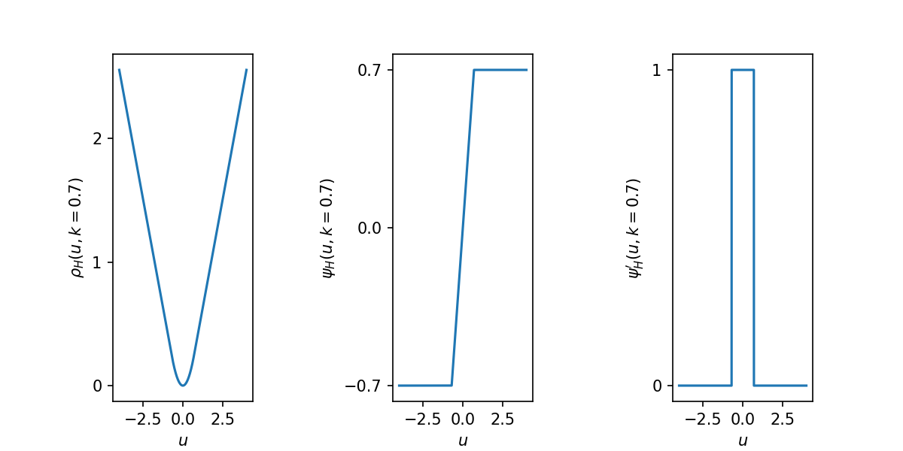
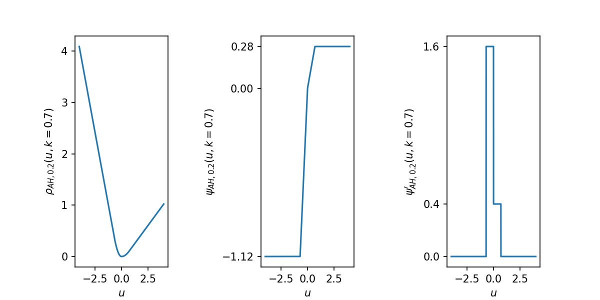

[](http://quantlet.de/)

## [](http://quantlet.de/) **GRF_huberized_loss** [](http://quantlet.de/)

```yaml


Name of Quantlet: GRF_huberized_loss

Published in: 'METIS'

Description: 'Visualisation of huberized loss function consisting of L1 and L2 loss, its scoring function and the derivative of the scoring function for symmetric and asymmetric loss function. The loss function can be used for approximation of functions, e.g. in Generalized Random Forests.'

Keywords: 'Loss function, asymmetric loss, huberized, scoring function, estimation '

Author: 'Marius Sterling'

See also: ''

Submitted:  '29.06.2020'

```





### PYTHON Code
```python

#!/usr/bin/env python3
# -*- coding: utf-8 -*-
"""
Created on Mon Jun 15 14:13:57 2020

@author: rdc
"""

import numpy as np
import matplotlib.pyplot as plt
from matplotlib.ticker import MaxNLocator


def loss_huber(x, k, tau=0.5):
    res = (np.abs(x) <= k) * x ** 2
    res += (np.abs(x) > k) * (2 * k * np.abs(x) - k**2)
    res *= np.abs((x < 0) - tau)
    return(res)


def score_huber(x, k, tau=0.5):
    res = (np.abs(x) <= k) * x * 2
    res += (np.abs(x) > k) * (2 * k * np.sign(x))
    res *= np.abs((x < 0) - tau)
    return(res)


def score_huber_deriv(x, k, tau=0.5):
    res = x*0
    res += (np.abs(x) <= k) * 2
    res = res.astype('float64')
    res *= np.abs((x < 0) * 1 - tau)
    return(res)


# %% Huberized Loss
k = 0.7
x = np.arange(-4, 4, 0.0001)


fig, ax = plt.subplots(ncols=3, figsize=(8, 4), dpi=150)
ax[0].plot(x, loss_huber(x, k))
ax[0].yaxis.set_major_locator(MaxNLocator(integer=True))
ax[0].set(xlabel=r'$u$', ylabel=r"$\rho_H(u,k={0})$".format(k))

ax[1].plot(x, score_huber(x, k))
ax[1].set_yticks([-k, 0, k])
ax[1].set(xlabel=r'$u$', ylabel=r"$\psi_H(u,k={0})$".format(k))

ax[2].plot(x, score_huber_deriv(x, k))
ax[2].yaxis.set_major_locator(MaxNLocator(integer=True))
ax[2].set(xlabel=r'$u$', ylabel=r"$\psi^\prime_H(u,k={0})$".format(k))

plt.subplots_adjust(wspace=1)
plt.savefig(
        fname='GRF_huberized_loss.png',
        dpi=150,
        transparent=True
)


# %% Asymmetric Huberized loss

tau = 0.2

fig, ax = plt.subplots(ncols=3, figsize=(8, 4), dpi=150)
ax[0].plot(x, loss_huber(x, k, tau))
ax[0].yaxis.set_major_locator(MaxNLocator(integer=True))
ax[0].set(xlabel=r'$u$', ylabel=r"$\rho_{AH,%.1f}(u,k=%.1f)$" % (tau, k))

ax[1].plot(x, score_huber(x, k, tau))
ax[1].set_yticks([-k * (1 - tau) * 2, 0, k * tau * 2])
ax[1].set(xlabel=r'$u$', ylabel=r"$\psi_{AH,%.1f}(u,k=%.1f)$" % (tau, k))

ax[2].plot(x, score_huber_deriv(x, k, tau))
ax[2].set_yticks([2*(1 - tau), 0, 2*tau])
ax[2].set(xlabel=r'$u$', ylabel=r"$\psi^\prime_{AH,%.1f}(u,k=%.1f)$" % (tau, k))

plt.subplots_adjust(wspace=1)
plt.savefig(
        fname='GRF_huberized_loss_asymmetric.png',
        dpi=150,
        transparent=True
)

```

automatically created on 2020-06-29