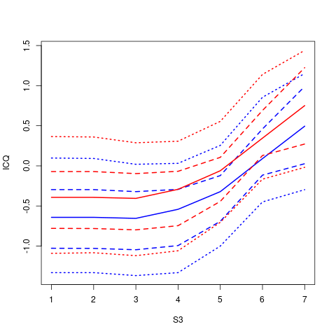
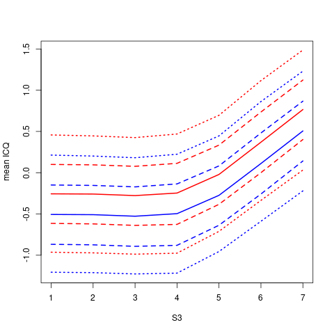
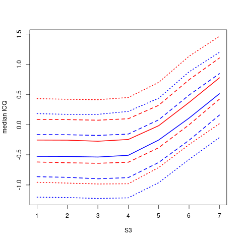
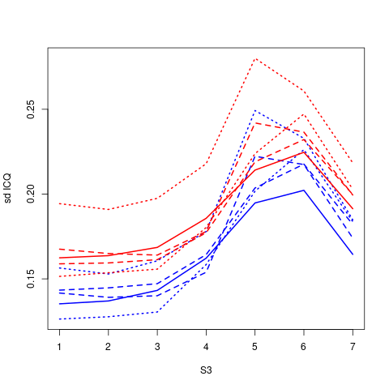
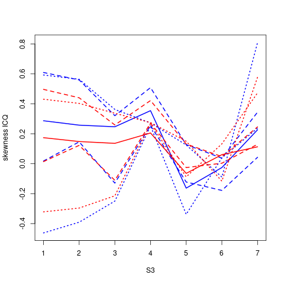

[](http://quantlet.de/)

## [](http://quantlet.de/) **GRF_mindscholars_quantileRF** [](http://quantlet.de/)

```yaml


Name of Quantlet: GRF_mindscholars_quantileRF

Published in: 'METIS'

Description: 'Computation and visualisation of aggregation of ICQ (individual conditional quantile) with and without treatment effect computed with a generalized Random Forest, for variable S3 (=Students self-reported expectation for success in the future) in the National Mindset Study data set used by Athey and Wager in "Estimating Treatment Effects with Causal Forests: An Application".'

Keywords: 'causal, treatment effect, GRF, generalized random forest, ICQ, individual conditional quantile, approximation, mindset, mindset nudging, quantile'

Author: 'Marius Sterling'

See also: ''

Submitted:  '31.08.2020'

```












### R Code
```r

# Example based on 
# https://github.com/grf-labs/grf/tree/master/experiments/

set.seed(42)
rm(list = ls())
libraries = c('grf', 'pROC', 'caret', 'future.apply', 'Hmisc',
              'lmtest', 'ggplot2', 'glue', 'moments')
lapply(libraries,function(x)if(!(x %in% installed.packages())){
  install.packages(x)})
lapply(libraries, library, quietly = TRUE, character.only = TRUE)

# Defining sink -----------------------------------------------------------
sink_on = function() sink(file = 'log.txt', append = TRUE)
sink_off = function() sink(file = NULL)

# sink_on = function() return()
# sink_off = function() return()


# Defining rsq and adj rsq ------------------------------------------------

rsq = function(x, x_pred){
  ss_tot = sum((x - mean(x))**2)
  ss_res = sum((x - x_pred)**2)
  return(1- ss_res/ss_tot)
}
rsq_adj = function(x, x_pred, p, model_with_const=TRUE){
  n = length(x)
  return(1 - (1-rsq(x, x_pred)) * (n - 1) / (n - p - 1 - ifelse(model_with_const, 1, 0)))
}

# Read in data ------------------------------------------------------------
data.all = read.csv("synthetic_data.csv")
data.all$schoolid = factor(data.all$schoolid)

DF = data.all[,-1]
school.id = as.numeric(data.all$schoolid)
school.mat = model.matrix(~ schoolid + 0, data = data.all)
school.size = colSums(school.mat)

# It appears that school ID does not affect pscore. So it can be ignored
# in modeling.
w.lm = glm(Z ~ ., data = data.all[,-3], family = binomial)
summary(w.lm)

# Setting up data set -----------------------------------------------------
trainIndex = createDataPartition(DF$Z, p = 0.75, list = FALSE)

W = DF$Z[trainIndex]
W_test = DF$Z[-trainIndex]
Y = DF$Y[trainIndex]
Y_test = DF$Y[-trainIndex]
X.raw = DF[,-(1:2)]

# Creation of dummy variables for multi label categorical variable C1 (student 
# race/ethnicity, 15 labels) and XC (School-lebel categorical variable for 
# urbanicity of the school)
C1_ = factor(X.raw$C1)
C1.exp = model.matrix(~ C1_ + 0)
XC_ = factor(X.raw$XC)
XC.exp = model.matrix(~ XC_ + 0)
X = cbind(X.raw[,-which(names(X.raw) %in% c("C1", "XC"))], C1.exp, XC.exp)
X_test = X[-trainIndex,]
X = X[trainIndex,]

# OLS regression ----------------------------------------------------------
model <- lm(Y ~ ., data = cbind(X, W))
Y_hat = predict(model)

sink_on()
print('linear regression')
summary(model)
print(glue::glue("MSE: {mean((Y_hat - Y)**2)}"))
print(glue::glue("rsq: {round(rsq(Y,Y_hat),4)}"))
print(glue::glue("rsq_adj: {round(rsq_adj(Y,Y_hat, model$rank),4)}"))
sink_off()

Y_test_hat = predict(model, newdata = cbind(X_test, W=W_test))
sink_on()
print('Test:')
print(glue::glue("MSE: {mean((Y_test_hat - Y_test)**2)}"))
print(glue::glue("rsq: {round(rsq(Y_test, Y_test_hat),4)}"))
print(glue::glue("rsq: {round(rsq_adj(Y_test, Y_test_hat, model$rank),4)}"))
sink_off()

# quantile causal forest -------------------------------------------------------
sink_on()
print('')
print('quantile RF:')
qRF <- quantile_forest(X = X, Y = Y, quantiles = c(0.1, 0.25, 0.5, 0.75, 0.9),
                       num.trees = 2000)
save(qRF, file = 'quantile_forest.Rdata')
rf = qRF
print(rf)
x = variable_importance(rf, max.depth = 50)
row.names(x) = colnames(X)
print(round(x[order(x, decreasing = TRUE),],4))

# print('propensity score RF:')
# propensityRF <- regression_forest(X = X, Y = W, tune.parameters = 'all', num.trees = 2000)
# roc = pROC::roc(W, propensityRF$predictions[,1])
# plot(roc)

print('causal RFs:')
cRFs = list()
for(q in qRF$quantiles.orig){
  cRF <- causal_forest(X = X, W = W, Y = Y,
                       Y.hat = predict(qRF, quantile = q)[,1],
                       tune.parameters = 'all', num.trees = 2000)
  cRFs[[as.character(q)]] = cRF
}
save(cRFs, file = 'causal_forests.Rdata')
rf = cRF[['0.5']]
print(rf)
x = variable_importance(rf, max.depth = 50)
row.names(x) = colnames(X)
print(round(x[order(x, decreasing = TRUE),],4))


# get_Y_hat function ------------------------------------------------------
get_var_xs = function(X, var, l = 100){
  return(seq(min(X[,var]), max(X[,var]), length.out = l))
}
get_Y_hat_for_var = function(regRF = regRF, var, i = NULL,
                             comp_variance = TRUE, X = X, l = 100,
                             cRF = NULL, q = 0.05){
  x = get_var_xs(X = X, var = var, l=l)
  X2 = data.frame(x)
  # X2 = data.frame(seq(-1, 1, length.out = 100))
  colnames(X2) = var
  if(is.null(i)){
    # X_fill = apply((X[,!colnames(X) %in% var]), 2, mean)
    X_fill = apply((X[,!colnames(X) %in% var]), 2, median)
  }else{
    X_fill = X[i, !colnames(X) %in% var]  
  }
  X2[, 2:(length(X_fill) + 1)] = X_fill
  colnames(X2)[2:ncol(X2)] = names(X_fill)
  
  Y_hat = data.frame(predict(regRF, X2, quantile = q))
  colnames(Y_hat) = 'predictions'
  if(!is.null(cRF)){
    # Y_hat = cbind(
    #   Y_hat, 
    #   'treatment_effect' =  predict(cRF, X2, quantile = q)$predictions
    # )
    Y_hat[, 'treatment_effect'] = predict(cRF, X2, quantile = q)
  }
  return(Y_hat)
}

# Plot settings -----------------------------------------------------------
settings = data.frame(
  'q' = qRF$quantiles.orig,
  'lty' = c(3, 2, 1, 2, 3),
  'col' = 'blue',
  'w' = 0,
  stringsAsFactors = FALSE
)
settings2 = settings 
settings2$col = 'red'
settings2$w = 1
ps = rbind(settings, settings2)

# ICQ (Individual Conditional Quantile) --------------------------------
var = 'S3'
Y_hat = list()
for(q in qRF$quantiles.orig){
  Y_hat[[as.character(q)]] = get_Y_hat_for_var(
    regRF = qRF, var = var, i = 2,
    comp_variance = TRUE, X = X_test, l = 7,
    q = q,  cRF = cRFs[[as.character(q)]]
  )
}
save(Y_hat, file = 'ICQ_one.Rdata')

png(file='ICQ_one.png', bg = 'transparent')
  mu = max(sapply(Y_hat, function(x) max(x$predictions + x$treatment_effect)))
  ml = min(sapply(Y_hat, function(x) min(x$predictions)))
  x = get_var_xs(X = X_test, var = var, l = 7)
  plot(x, Y_hat[['0.5']]$predictions, xlab = var, ylab = "ICQ", type = "n", ylim = c(ml, mu))
  for(i in 1:nrow(ps)){
    lines(
      x = x, 
      y = Y_hat[[as.character(ps[i, 'q'])]]$predictions + ps[i, 'w'] * Y_hat[[as.character(ps[i, 'q'])]]$treatment_effect,
      lwd = 2,
      lty = ps[i, 'lty'],
      col = ps[i, 'col']
    )
  }
dev.off()
# Mean/Median/SD/... ICQ ----------------------------------------------------------------

plan(multisession) ## Run in parallel on local computer
Y_hats = list()
for(q in qRF$quantiles.orig){
  Y_hats[[as.character(q)]] = future_lapply(1:nrow(X_test), function(i) {
    get_Y_hat_for_var(
      regRF = qRF,
      var = var,
      i = i,
      X = X_test,
      l = 7,
      comp_variance = TRUE,
      q = q,
      cRF = cRFs[[as.character(q)]]
    )},
    future.packages	= c('grf')
  )
}
save(Y_hats, file = 'ICQ_test.Rdata')

Y_hat = function(fun = mean){
  Y_hat = list()
  for(w in unique(W_test)){
    Y_hat[[as.character(w)]] = lapply(
      Y_hats, 
      function(x) apply(
        sapply(x, function(xx) {xx$predictions + w * xx$treatment_effect}),
        MARGIN = 1,
        FUN = fun
      )
    )
  }
  return(Y_hat)
}

for (fun in c('mean', 'median', 'sd', 'skewness', 'kurtosis')){
  png(file=glue('ICQ_{fun}.png'), bg = "transparent")
    tmp_Y_hat = Y_hat(fun)
    var = 'S3'
    ylim = range(unlist(tmp_Y_hat))
    x = get_var_xs(X = X_test, var = var, l = 7)
    plot(x, tmp_Y_hat[['0']][['0.5']], xlab = var, ylab = glue("{fun} ICQ"), type = "n", ylim = ylim)
    for(i in 1:nrow(ps)){
      lines(
        x = x, 
        y = tmp_Y_hat[[as.character(ps[i, 'w'])]][[as.character(ps[i, 'q'])]],
        lwd = 2,
        lty = ps[i, 'lty'],
        col = ps[i, 'col']
      )
    }
  dev.off()
}
```

automatically created on 2020-09-14
